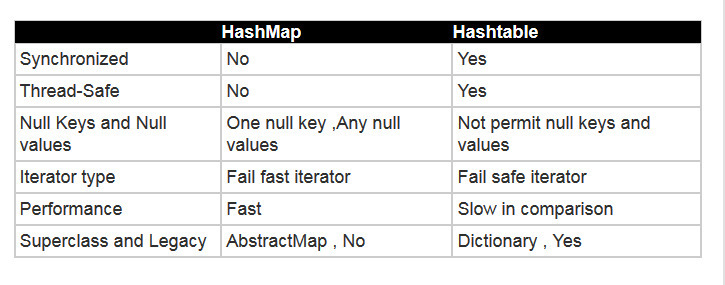
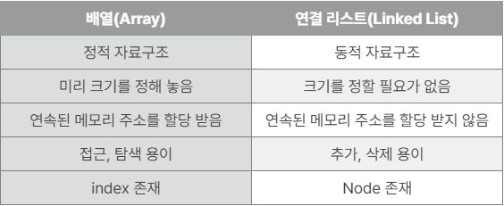

# DataStructure

- **Stack의 구조와 개념을 설명하고 Stack의 실사용 예를 설명해주세요.**

스택은 말 그대로 쌓아 놓은 더미를 뜻하며, 가장 최근에 들어온 데이터가 가장 먼저 나가는 LIFO(후입선출)방식의 선형 데이터 구조입니다. 스택의 사용 예시로는 브라우저의 뒤로가기, 실행 취소(undo) 등이 있습니다.

- **HashMap과 Hashtable의 차이점에 대해 설명해주세요.**
  

HashMap과 HashTable의 가장 큰 차이는 Thread-safe입니다. HashTable은 모든 메소드에 syncronized가 선언되어 스레드간 동기화 락을 통해 멀티 스레드 환경에서 data의 무결성을 보장해주며, HashMap은 syncronized로 선언되지 않아서 싱글 스레드 환경에서 사용하기 좋습니다.

그러나 멀티 스레드 환경이라도 HashTable은 Collection Framework이 나오기 이전부터 존재한 구형 버전이므로 ConcurrentHashMap을 사용하는 것이 더 좋은 방법입니다.

- **Array와 LinkedList의 차이가 무엇인가요? 각각 가장 큰 특징과 그로 인해 발생하는 장점과 단점에 대해 설명해주세요.**

Array(배열)은 **정적 자료구조**로 정해진 크기의 메모리에 순서대로 데이터를 저장하는 반면, LinkedList(연결 리스트)는 **동적 자료구조**로 다음 데이터의 위치에 대한 포인터(주소)를 가지고 있는 구조적 차이가 있습니다.

배열은 데이터가 메모리에 연속적으로 있어서 인덱스로 조회할 수 있기 때문에 인덱스 조회 성능이 높지만, 미리 크기를 정해 놓았기 때문에 정해진 크기 이상의 데이터를 저장할 수 없는 단점이 있습니다.

연결 리스트는 크기의 제한이 없기 때문에 데이터의 추가, 삭제가 자유롭습니다. 하지만 배열처럼 연속적인 메모리 주소를 할당 받지 않았기 때문에 데이터 조회 시 순차적으로 탐색해야 하는 단점이 있습니다.

- **PriorityQueue의 동작 원리가 어떻게 되나요?**

PriorityQueue는 완전 이진 트리 형태로 이루어져 있습니다. 데이터 삽입 시 완전 이진 트리를 유지하는 형태로 순차적으로 삽입되며, 삽입 이후 루트 노드까지 거슬러 올라가며 최대 힙 또는 최소 힙을 구성합니다. 삭제의 경우 루트 노드를 제거한 후 가장 마지막 원소를 루트 노드에 위치 시킵니다. 이후 자식 노드와 비교하며 최대 힙 또는 최소 힙을 다시 구성합니다.

- **그래프와 트리의 차이는 무엇인가요?**

그래프와 트리 모두 노드와 간선으로 구성된 자료구조이지만 트리는 그래프의 속한다고 볼 수 있습니다. 그래프는 순환, 비순환 구조 모두 가질 수 있지만 트리는 순환 구조를 가질 수 없습니다. 또한 그래프는 루트 노드의 개념이 없고, 부모-자식 관계가 없지만 트리는 모두 가지고 있습니다.

- **B+ tree 의 개념과 구조를 설명해주세요.**

B+ tree는 B tree의 확장 개념으로 인덱스를 이루고 있는 자료구조입니다. 이진 트리를 확장해 하나의 노드가 가질 수 있는 자식 노드의 최대 숫자가 2보다 큰 트리 구조입니다. B+ tree는 B tree와 다르게 리프 노드에만 모든 key와 data를 저장하며, 리프 노드는 서로 Linked List로 연결되어 있습니다. B+ tree는 리프 노드를 제외한 노드에는 데이터를 담지 않기 때문에 메모리 관리에 더 유리하며, 데이터 삽입, 삭제 시 리프 노드에서 선형 탐색이 가능하므로, B tree에 비해 빠른 처리가 가능합니다.

- **이진 탐색 트리의 최악의 시간복잡도를 말하고, 어떤 경우에 그렇게 되는지 말해보세요.**

이진 탐색 트리의 시간복잡도는 O(logN) 이지만, 최악의 경우 O(N)이 됩니다. 이진 탐색 트리는 각 노드의 왼쪽 자식은 부모보다 작고, 오른쪽 자식은 부모보다 크다는 규칙이 있습니다. 이러한 특징 때문에 한쪽 방향으로만 이루어진 트리일 경우 트리의 높이가 계속해서 높아지기 때문에 O(N)의 시간 복잡도가 나올 수 있습니다.

- **Red-Black Tree에 대해 설명해주세요.**

RB Tree는 일종의 자기 균형 이진 트리로 삽입, 삭제 시 균형이 무너지지 않는 자료구조입니다. RB Tree의 모든 리프 노드는 NIL Node라는 key나 data를 포함하지 않는 가상의 노드를 가지며, 이진 트리에 몇몇 규칙이 추가된 자료구조입니다. 그 규칙은 모든 노드는 레드 또는 블랙의 색을 가지고, 루트 노드와 모든 NIL 노드는 항상 블랙이며, 레드 노드는 연속 적으로 나올 수 없고, 루트 노드에서 모든 리프 노드까지의 경로에 대해서 거치는 블랙 노드의 숫자는 같다는 규칙이 있습니다.

RB Tree는 Tree의 균형이 유지되기 때문에 최악의 경우에도 모든 시간 복잡도는 O(logN)이 보장됩니다.
