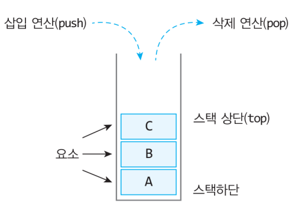

## Stack의 특징
- LIFO(후입선출)
- 삽입과 삭제를 리스트의 한쪽(top)에서 행함

## Stack의 사용 사례
- 재귀 알고리즘
  - 스택에는 함수의 매개변수, 호출이 끝난 뒤 돌아갈 반환 주소 값, 함수에서 선언된 지역 변수 등이 저장됨
  - 이렇게 스택 영역에 차례대로 저장되는 함수의 호출 정보를 스택 프레임이라고 함
- 웹 브라우저 방문 기록(뒤로 가기) -> 복귀 주소
- 실행 취소(undo)

## Stack의 구조

