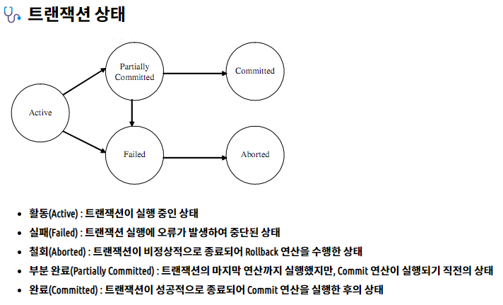
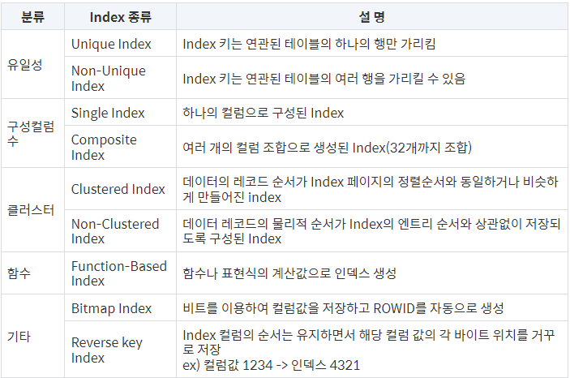
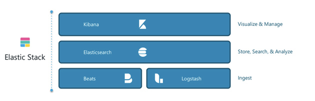
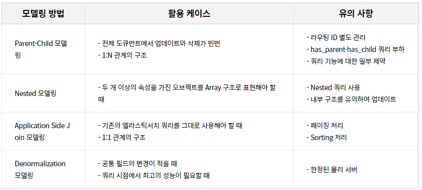

# Database

## 1. 트랜잭션이란 무엇인지 설명해주시고 트랜잭션의 특성을 말씀해주세요.

- 트랜잭션은 데이터베이스의 상태를 변화 시키는 하나의 논리적 기능을 수행하기 위한 작업의 단위입니다. 데이터베이스의 상태를 변화 시키는 것은 질의어(SELECT, INSERT, DELETE, UPDATE)를 통한 데이터 베이스로의 접근을 의미하며, 작업의 단위는 사람이 정하는 기준에 따라 한꺼번에 모두 수행되어야 할 일련의 연산을 뜻합니다.
- 트랜잭션의 특징으로는 크게 4가지로 원자성, 일관성, 독립성, 영속성이 있습니다.
  원자성(Atomicity)은 트랜잭션 내의 모든 명령은 반드시 완벽히 수행되어야 함을 뜻하며 부분적으로 실행되거나 중단되지 않는 것을 보장합니다. 이러한 특징으로 트랜잭션의 연산은 모두 반영되도록 Commit 되거나 전혀 반영되지 않도록 Rollback 되어야 합니다.
  일관성(Consistency)는 트랜잭션의 작업 처리 결과는 항상 일관성이 있어야 합니다. 트랜잭션이 진행되는 동안에 데이터베이스가 변경 되더라도 업데이트 된 데이터베이스로 트랜잭션이 진행되는 것이 아니라, 처음에 트랜잭션을 진행 하기 위해 참조한 데이터베이스로 진행되어 각 사용자는 일관성 있는 데이터를 볼 수 있습니다.
  독립성(Isolation)은 트랜잭션 수행 시 다른 트랜잭션 연산에 끼어들지 못하도록 보장하는 것입니다. 수행 중인 트랜잭션은 완전히 완료될 때까지 다른 트랜잭션에서의 수행 결과를 참조할 수 없음을 뜻합니다.
  영속성(Durability)는 트랜잭션이 성공적으로 완료됐을 경우, 결과는 영구적으로 반영되어야 한다는 특징입니다.

## 2. OLTP와 OLAP의 차이점이 무엇인가요?

- OLTP는 운영계 데이터 및 데이터 처리하는 방법을 의미하며, OLAP는 분석계 데이터 및 데이터 처리하는 방법을 의미합니다.
  OLTP는 복수의 사용자 PC에서 발생되는 트랜잭션을 DB 서버가 처리하고 그 결과를 요청한 사용자에게 결과 값을 되돌려주는 과정입니다. 즉, 1개의 트랜잭션에서 발생되는 INSERT, UPDATE, DELETE의 과정을 무결성을 보장하여 처리하고 그 결과를 SELECT 하는 과정을 OLTP라 합니다.
  OLAP는 데이터 웨어하우스 또는 데이터 마트에 저장되어 있는 데이터를 분석, 사용자에게 유의미한 정보를 제공해주는 처리 방법입니다. 기존에 저장되어 있는 대용량 데이터를 사용자의 요구와 목적에 맞게 분석하여 특정 지표 추출, 리포트 생산과 같은 정보를 제공하는 개념입니다.

## 3. 인덱스의 개념, 장점, 종류에 대해서 설명해주세요.

- 인덱스는 데이터베이스 테이블에 대한 검색 성능의 속도를 높여주는 자료구조입니다. 인덱스는 데이터들을 정렬하여 별도의 메모리 공간에 데이터의 물리적 주소와 함께 저장됩니다.
  데이터를 정렬하여 저장하기 때문에 Where절, Order by, MIN, MAX와 같은 기능에 대한 부하가 적고 검색과 정렬의 속도를 향상 시킬 수 있으며, 전반적인 시스템의 부하를 줄일 수 있다는 장점이 있습니다.
  인덱스의 종류는..

## 4. 사용해보신 데이터베이스 중 하나를 골라 해당 데이터베이스의 엔진이 무엇이었는지, 해당 엔진의 특징은 무엇인지 설명해주세요.

- MySQL을 주로 사용했으며, MySQL의 엔진 중 InnoDB를 사용해 봤습니다. InnoDB의 특징은 테이블이 Primary Key 순서대로 디스크에 저장되기 때문에 Range Scan이 굉장히 빠르며, 실행계획 결정에서 다른 보조 인덱스에 비해 Primary Key가 선택될 확률이 높습니다. 또한 기존 엔진에서 지원하지 않던 Foreign Key를 지원합니다. 이외에도 ACID를 보장하며, MVCC Scan 등 다양한 특징이 있습니다.

## 5. 정규화와 비정규화에 대해 설명해주세요.

- 정규화 데이터베이스는 중복을 최소화하도록 설계된 데이터베이스를 뜻하며, 비정규화 데이터베이스는 읽는 시간을 최적화하도록 설계된 데이터베이스를 뜻합니다.
  정규화는 데이터를 구조화하는 작업으로 특정 조건을 만족하는 릴레이션의 스키마 형태를 말하는데 제 1정규형, 제 2정규형, 제 3정규형, BCNF 형, 제 4 정규형, 제 5 정규형이 있습니다. 정규화의 장점은 데이터베이스 변경 시 이상현상(Anomaly) 제거, 데이터 구조의 안정성 및 무결성 유지, 효과적인 검색 알고리즘 등이 있으나 릴레이션 간의 JOIN 연산 증가라는 단점이 있습니다.
  이와 반대로 비정규화는 의도적으로 정규화 원칙을 위해하여 하나 이상의 테이블에 데이터를 중복해 배치하는 최적화 기법입니다. 비정규화는 정규화된 데이터 모델을 통합, 중복, 분리하여 시스템의 성능 향상, 개발 및 운영의 편의성 등을 향상 시킵니다. 비정규화의 장점은 JOIN 비용이 줄어들기 때문에 빠른 데이터 조회가 가능하며, 데이터 조회 쿼리가 단순해 집니다. 하지만 데이터가 중복 저장되기 때문에 데이터 갱신이나 삽입 비용이 높고, 데이터의 무결성을 해치며, 중복으로 인한 추가 저장 공간이 필요하단 단점이 있습니다.

## 6. ACID가 뭔가요?

- ACID는 데이터베이스 내에서 일어나는 하나의 트랜잭션의 안전성을 보장하기 위해 필요한 성질입니다.
  Atomicity(원자성)은 시스템에서 한 트랜잭션의 연산들이 모두 성공하거나, 반대로 전부 실패되는 성질을 말합니다. 원자성은 작업이 모두 반영되거나 모두 반영되지 않음으로서 결과를 예측할 수 있어야 합니다.
  Consistency(일관성)은 데이터베이스의 상태가 일관되어야 한다는 성질입니다. 트랜잭션이 진행되는 동안에 데이터베이스가 변경 되더라도 업데이트 된 데이터베이스로 트랜잭션이 진행되는 것이 아니라, 처음에 트랜잭션을 진행 하기 위해 참조한 데이터베이스로 진행되어 각 사용자는 일관성 있는 데이터를 볼 수 있습니다.
  Isolation(독립성)은 모든 트랜잭션은 다른 트랜잭션으로부터 독립되어야 한다는 뜻입니다. 수행 중인 트랜잭션은 완전히 완료될 때까지 다른 트랜잭션에서의 수행 결과를 참조할 수 없습니다.
  Durability(영속성)은 하나의 트랜잭션이 성공적으로 수행되었다면, 해당 트랜잭션에 대한 로그가 남아야하는 성질을 뜻합니다. 즉, 런타임 오류나 시스템 오류가 발생하더라도, 해당 기록은 영구적이어야 한다는 뜻입니다.

## 7. RDBMS vs NOSQL에 대해서 설명해주세요.

- 기본적으로 RDBMS는 정형 데이터를, NOSQL은 비정형 데이터를 다룬다는 차이점이 있습니다. RDBMS는 관계형 데이터베이스 관리 시스템으로 객체들의 릴레이션을 통해서 데이터를 저장하는 데이터베이스입니다. SQL을 사용하여 데이터의 저장, 질의, 수정, 삭제를 할 수 있으며 데이터를 효율적으로 보관하여 명확한 데이터 구조를 보장하지만 성능을 향상 시키기 위해서는 Scale-up만을 지원하여 비용이 많이 든다는 단점이 있습니다.
  NOSQL은 RDBMS와는 달리 테이블 간 관계를 정의하지 않습니다. 고정된 스키마가 존재하지 않기 때문에 데이터 추가 시 구조에 대한 정의를 변경할 필요가 없어 다양한 타입을 가질 수 있습니다. 또한 성능 향상을 위해 Scale-up 뿐만 아니라 Scale-out도 지원하여 수평적 확장이 가능하고, RDBMS에 비해 대용량의 데이터를 저장할 수 있습니다. 다만, 데이터가 중복될 수 있으며 데이터 변경 시 모든 컬렉션에서 수정을 수행해야 하며, 데이터 구조가 명확하지 않아 데이터 구조 결정에 어려움이 있을 수 있습니다.

## 8. Elasticsearch에 대해서 간단히 설명해주세요.

- ElasticSearch는 Apache Lucene(아파치 루씬) 기반의 Java 오픈소스 분산 검색 엔진으로 분산형 RESTful 검색 및 분석 엔진으로 Elastic Stack의 중심에 위치합니다. Elastic Stack은 검색, 분석, 데이터 저장소 역할을 하는 Elasticsearch, 데이터 수집을 담당하는 Beats, 정제, 전처리를 수행하는 Logstash, 시각화, 관리 기능을 제공하는 Kibana로 구성됩니다. 엘라스틱은 매우 빠른 속도와 확장성, 복원성뿐 아니라 정형·비정형 데이터를 모두 수용할 수 있는 유연성을 가지고 있습니다. 이 같은 장점으로 인해 단순 검색엔진으로 활용하는 단계를 넘어 빠른 데이터 확인이 필요한 모든 분야에서 관심을 끌고 있습니다. 마케팅 분석·비즈니스 서비스·인프라 모니터링·보안-실시간 탐지 등이 대표적입니다.

- ElasticSearch는 단어 기반(역인덱스, Inverted Index)으로 데이터를 저장합니다. 이로 인해 ElasticSearch는 특정 단어가 어디에 저장되어 있는지 이미 알고 있어 행 기반 저장 구조와는 다르게 모든 도큐먼트를 검색할 필요 없이 한 번의 조회로 검색을 끝낼 수 있습니다. 다만, 수정과 삭제는 내부적으로 굉장히 많은 리소스가 소요되는 작업이므로 RDB와 Elastic영역을 나누어 아키텍처링 하는 것이 필요합니다.

