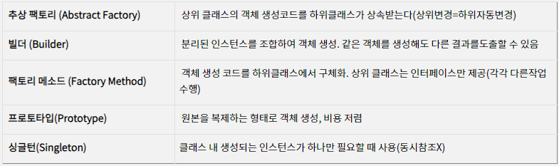
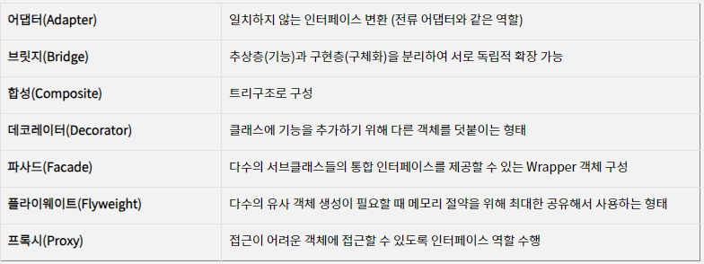
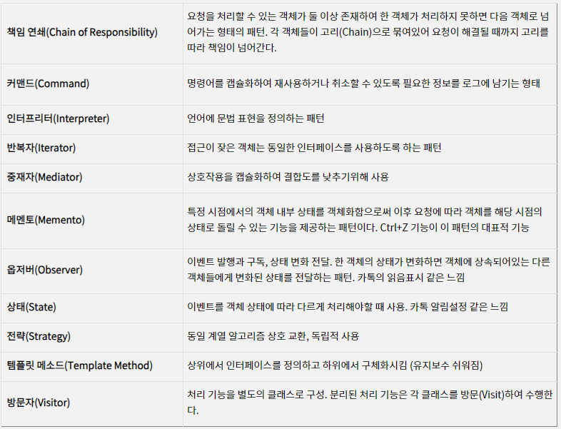

# Design Pattern

### 1. 사용해 본 디자인 패턴이 있나요? 있다면 어떤 패턴을 사용했고 왜 사용했나요?

- Android App을 개발하면서 네트워크 통신을 위해 Volley 라이브러리를 사용하며 해당 라이브러리를 Singleton 패턴으로 사용한 경험이 있습니다. Volley Instance를 Singleton으로 사용한 이유는 잦은 네트워크 통신에서 요청마다 Instance를 생성하는 것은 메모리 낭비로 인해 효율성이 떨어지기 때문에 Singleton을 사용하여 단 하나의 Instance만 생성하여 메모리 사용의 효율적이게 사용했으며, 하나의 Instance를 전역으로 관리하기 때문에 애플리케이션 전반에서 동일한 Volley 요청을 일관성있게 유지할 수 있었습니다.
- Spring boot를 사용하며 Builder 패턴을 사용해 봤습니다. Builder 패턴은 생성 패턴 중 하나 이며 복잡한 객체의 생성 과정 및 표현 방법을 분리해 서로 다른 표현 결과를 만들 수 있습니다. 즉, 매개 변수가 많은 생성자나 각 유형에 따른 생성자, 무분별한 Setter를 대체하여 Builder 패턴을 통해 개발자가 필요한 데이터만 설정할 수 있고, 가독성을 높이며, 데이터의 유연한 변경이 가능합니다.

### 2. MVC, MVP, MVVM 패턴에 대해 각각의 구조와 장단점을 설명해 주세요.

- MVC 패턴은 Model, View, Controller로 이루어져 있습니다. Model은 데이터와 비즈니스 로직을 담당하고, View는 사용자 인터페이스를 표현하며, Controller는 사용자의 입력을 처리하고 Model과 View를 관리합니다. MVC 패턴의 장점으로는 역할과 책임을 분리하여 코드의 가독성과 유지보수성이 향상되어 보편적으로 많이 사용됩니다. 단점은 복잡한 애플리케이션에서 Controller가 과도하게 커질 수 있고, View와 Model 사이의 의존성이 높아져 코드의 복잡성이 증가하고 유지보수가 어려워집니다.
- MVP 패턴은 Model, View, Presenter로 이루어져 있습니다. Model은 MVC 패턴과 동일하게 데이터와 비즈니스 로직을 담당하고, View는 사용자 인터페이스를 표현하며, UI 이벤트를 Presenter로 전달합니다. Presenter는 View와 Model 사이의 중간 역할을 수행하며, View의 상태를 업데이트하고 Model로부터 데이터를 가져와 View에 전달합니다. MVP 패턴의 장점으로는 MVC 패턴에 문제점이었던 View와 Model의 의존성이 없어지고 독립성이 증가하여 테스트가 용이하고, 가독성이 높아집니다. 단점으로는 View와 Presenter 간의 의존성이 높아지고, 양방향 통신이 필요하여 코드의 복잡성이 증가할 수 있습니다.
- MVVM 패턴은 Model, View, View Model로 이루어져 있습니다. 마찬가지로 Model은 데이터와 비즈니스 로직을 담당하고 View는 사용자 인터페이스를 표현합니다. View Model은 View와 Model 사이의 중간 역할을 수행하며, View에 표시할 데이터를 가공하고, View에서 발생한 이벤트를 Model에 전달합니다. MVVM 패턴의 장점으로는 View와 Model의 완전한 분리로 인해 의존성이 없으며, 데이터 바인딩을 통해 View와 View Model 사이에도 의존성 없이 데이터를 동기화 할 수 있습니다. 단점으로는 View Model의 설계가 어렵고, 간단한 애플리케이션에서는 상대적으로 과도하게 복잡하게 느껴질 수 있습니다.

### 3. 생성 패턴 중 Builder Pattern에 대해 설명해주세요.

- Builder 패턴은 생성 패턴 중 하나 이며 복잡한 객체의 생성 과정 및 표현 방법을 분리해 서로 다른 표현 결과를 만들 수 있습니다. 즉, 매개 변수가 많은 생성자나 각 유형에 따른 생성자, 무분별한 Setter와 같이 각 인스턴스의 특징마다 특정 인자가 있고 없고에 따라서 생성자를 만들기 때문에 객체 생성 시 명확성이 떨어지며, 코드의 가독성 또한 떨어지게 됩니다. 이러한 문제로 인해서 Builder 패턴을 사용하면 필요한 데이터만 설정할 수 있으며, 새로운 변수 추가 시 유연성과 가독성을 높일 수 있습니다.

### 4. 싱글톤 패턴에 대해 설명해주세요.

- Singleton 패턴은 생성 패턴 중 하나 이며 클래스의 인스턴스가 하나만 생성되도록 보장하는 패턴입니다. 즉, 어떤 클래스가 여러 곳에서 사용되지만 오직 하나의 인스턴스만 존재하도록 하는 것이 목적입니다. 이를 통해 인스턴스를 전역적으로 접근할 수 있으며, 리소스를 공유하거나 중복 생성을 방지하여 메모리 절약을 할 수 있습니다. 단점으로는 멀티스레드 환경에서 동기화에 주의하여야 하며, 너무 과도하게 사용하는 것은 다른 클래스의 인스턴스들 간에 결합도를 높일 수 있어 객체 지향적인 설계를 저해할 수 있습니다.

### 5. 디자인 패턴의 개념과 알고있는 디자인 패턴의 종류를 말해주세요.

- 디자인 패턴은 소프트웨어 설계 시 자주 발생하는 문제들을 피하기 위해 사용되는 방법 중 하나로 과거의 소프트웨어 개발 과정에서 발견된 설계의 노하우를 축적하여 이름을 붙여, 이후에 재이용하기 좋은 형태로 특정의 규약을 묶어서 정리한 것입니다.
- 지금까지 정말 많은 디자인 패턴이 있지만, 가장 유명하고 많이 쓰이는 패턴은 총 23개의 패턴을 정리한 GoF 디자인 패턴이 있습니다. GoF 디자인 패턴은 크게 생성 패턴, 구조 패턴, 행위 패턴이 있습니다.
- 생성 패턴은 객체 생성에 관련된 패턴으로, 객체의 생성과 조합을 캡슐화해 특정 객체가 생성되거나 변경되어도 프로그램 구조에 영향을 크게 받지 않도록 유연성을 제공합니다.

  

- 구조 패턴은 클래스나 객체를 조합해 더 큰 구조를 만드는 패턴입니다. 예를 들어 서로 다른 인터페이스를 지닌 2개의 객체를 묶어 단일 인터페이스를 제공하거나 서로 다른 객체들을 묶어 새로운 기능을 제공하는 패턴입니다.

  

- 행위 패턴은 객체나 클래스 사이의 알고리즘이나 책임 분배에 관련된 패턴입니다. 한 객체가 혼자 수행할 수 없는 작업을 여러개의 객체로 어떻게 분배하는지, 또 그렇게 하면서도 객체 사이의 결합도를 최소화하는것에 중점을 두는 방식입니다.
  

### 6. 결합도와 응집도에 대해 설명해주세요.

- 결합도는 서로 다른 모듈 간에 상호 의존하는 정도 또는 연관된 관계를 의미합니다. 예를 들면, 결합도가 높은 클래스는 다른 클래스와 연관된 정도가 높아서 해당 클래스를 변경하면 연관된 클래스도 변경해야 하며, 다른 코드에서 클래스를 재사용하기도 어렵습니다. 응집도는 한 모듈 내부의 처리 요소들이 서로 관련되어 있는 정도를 말합니다. 즉, 모듈이 독립적인 기능을 수행하는지 또는 하나의 기능을 중심으로 책임이 잘 뭉쳐있는지를 나타내며 모듈이 높은 응집도를 가질수록 좋습니다. 그러므로 모듈 설계는 결합도는 낮게 응집도는 높게 설계하는게 좋습니다.
- 결합도는 자료 결합도 → 스탬프 결합도 → 제어 결합도 → 외부 결합도 → 공통 결합도 → 내용 결합도 순서로 높아집니다.
  - 자료 결합도(Data Coupling)
    가장 낮은 결합도를 가지며, 가장 좋은 형태입니다. 모듈끼리 단순히 파라미터 등을 통해 데이터를 주고받는 경우입니다.
  - 스탬프 결합도(Stamp Coupling)
    두 모듈이 동일한 자료 구조를 참조하는 형태의 결합도입니다. 즉, 모듈 간의 인터페이스로 배열 또는 오브젝트 등이 전달되는 경우를 말합니다. 자료 구조의 형태가 변경되면 그것을 참조하는 모든 모듈에 영향을 주며 변경되는 필드를 실제로 참조하지 않는 모듈에도 영향을 줍니다.
  - 제어 결합도(Control Coupling)
    어떤 모듈이 다른 모듈 내부의 논리적인 흐름을 제어하는 요소를 전달하는 경우를 말합니다. 예를 들면, 파라미터로 전달되는 값에 따라서 모듈 내부 로직의 처리가 달라지는 Flag 값 등으로 결합되는 형태를 말합니다.
  - 외부 결합도(External Coupling)
    모듈이 외부에 있는 다른 모듈 또는 데이터를 참조할 때의 결합 형태를 말합니다. 모듈이 외부의 데이터, 통신 프로토콜 등을 공유할 때 발생합니다.
  - 공통 결합도(Common Coupling)
    여러 모듈이 하나의 데이터 영역을 참조하여 사용하는 형태입니다. 전역 변수(global variable)를 예로 들 수 있으며, 전역 변수의 변경이 여러 모듈에 영향을 끼칠 수 있습니다.
  - 내용 결합도(Content Coupling)
    가장 높은 결합도이며 가장 좋지 않은 결합 형태입니다. 어떤 모듈이 사용하려는 다른 모듈의 내부 기능과 데이터를 직접 참조하는 경우입니다. 다른 모듈의 로컬 데이터에 접근하는 경우처럼 사용하고자 하는 모듈의 내용(코드)을 알고 있어야 합니다. 모듈이 변경이 발생하는 경우 이를 참조하는 모듈의 변경이 반드시 필요하게 되므로 가장 좋지 않은 결합입니다.
- 응집도는 기능적 응집도 → 순차적 응집도 → 통신적 응집도 → 절차적 응집도 → 시간적 응집도 → 논리적 응집도 → 우연적 응집도 순서로 낮아집니다.
  - 기능적 응집도(Functional Cohesion)
    응집도가 가장 높으며, 가장 좋은 형태입니다. 모듈 내의 모든 요소들이 하나의 기능을 수행하기 위해 구성된 경우를 말합니다. 예를 들면, 코사인(cosine)과 같은 삼각함수를 계산하는 기능을 모아둔 함수 등이 있습니다.
  - 순차적 응집도(Sequential Cohesion)
    한 요소의 출력이 다른 요소의 입력으로 사용되는 형태입니다.
  - 통신적 응집도(Communication Cohesion)
    모든 요소들이 동일한 입력 또는 출력 데이터를 사용하여 서로 다른 기능을 수행하는 경우입니다. 순차적 응집도와 다르게 처리 순서가 중요하지 않습니다.
  - 절차적 응집도(Procedural Cohesion)
    모듈이 다수의 관련 기능을 가질 때, 모듈 안의 구성 요소들이 그 기능을 순차적으로 수행하는 경우입니다. 예를 들면, 파일을 읽을 때 접근 허가를 확인한 후 파일을 읽는 경우가 있습니다.
  - 시간적 응집도(Temporal Cohesion)
    각 기능 요소들이 순서에 상관없이 특정 시점에 반드시 수행되는 경우입니다. 예를 들면, 프로그램이 구동될 때 초기화 시키는 모듈이나 예외 상황이 발생했을 때 오류 로그를 개발자에게 전송하는 기능 등 순서에 상관없는 경우를 말합니다.
  - 논리적 응집도(Logical Cohesion)
    유사한 성격을 갖거나 특정 형태로 분류되는 처리 요소들로 모듈을 구성하며 논리적으로 비슷한 기능을 수행하지만 서로의 관계는 밀접하지 않은 형태입니다.
  - 우연적 응집도(Coincidental Cohesion)
    가장 좋지 않은 응집도입니다. 모듈 내부의 각 구성 요소들이 아무런 관련 없이 구성된 형태입니다. 논리적 응집도와 비슷하지만, 유사한 성격이나 형태가 없으며 모듈 수정이 사이드 이펙트를 발생시킬 가능성이 매우 높습니다.

### 7. SOLID와 GRASP에 대해 간략히 설명해주세요

- SOLID 원칙이란 객체지향 설계에서 지켜줘야 할 5개의 소프트웨어 개발 원칙을 말합니다. SOLID의 구성은 SRP(Single Responsibility Principle) 단일 책임의 원칙, OCP(Open Close Principle) 개방 폐쇄 원칙, LSP(Listov Substitution Principle) 리스코프 치환 원칙, ISP(Interface Segregation Principle) 인터페이스 분리 원칙, DIP(Dependency Inversion Principle) 의존 역전 원칙이 있습니다.
- GRASP 패턴(General Responsibility Assignment Software Patterns)은 객체 지향 디자인의 클래스 및 객체에 책임을 할당하기 위한 지침으로 총 9가지로 Creator(창조자), High Cohesion(높은 응집력), Low Coupling(낮은 결합도), Information Expert(정보 전문가), Controller, Polymorphism(다형성), Pure Fabrication(순수 조립), Indirection(간접 참조), Protected Variations(변화에 대한 보호)로 구성됩니다.

### 8. 구조 패턴 중 Composite Pattern에 대해 설명해주세요.

- Composite Pattern은 객체들의 관계를 트리 구조로 구성하여 부분-전체 계층을 표현하는 패턴으로 사용자는 Composite Pattern을 통해 단일 객체와 복합 객체 모두 동일하게 다룰 수 있습니다. 구조로는 Component, Leaf, Composite로 구성되며 Component는 클라이언트가 composition내의 오브젝트들을 다루기 위해 제공되는 인터페이스입니다. Leaf는 omposition내 오브젝트들의 행동을 정의합니다. 이는 복합체를 구성하는데 중요한 요소이며, 베이스 컴포넌트를 구현합니다. Composite는 • Leaf객체들로 이루어져 있으며 컴포넌트 내 명령들을 구현합니다.
