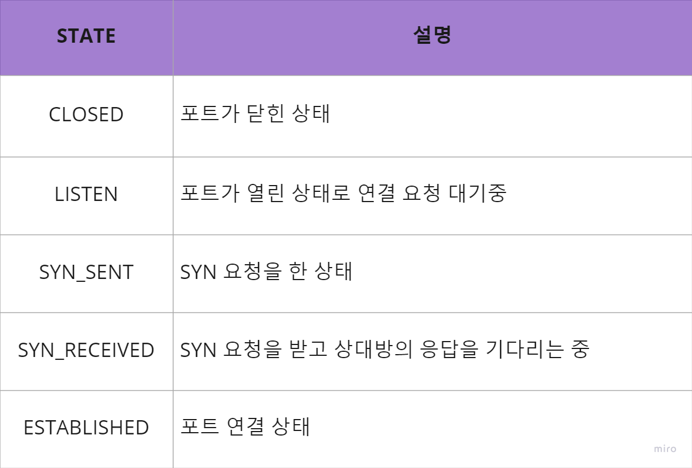
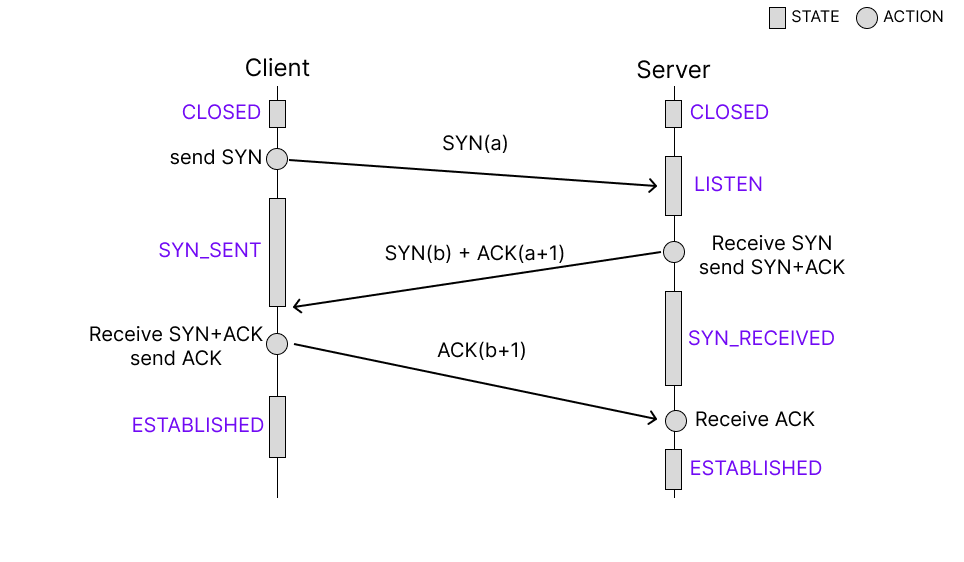

# Network

## [www.~.com에](http://www.%7E.xn--com-568n/) 접속할 때 생기는 과정에 대해 설명해주세요.(웹 동작 방식 이해)

<aside>
💡

1. **브라우저 주소창**에 [www.~.com](http://www.%7E.xn--com-568n/)을 입력한다.
2. 브라우저가 [www.~.com](http://www.%7E.xn--com-568n/)의 **IP 주소**를 찾기 위해 **캐시**에서 **DNS 기록**을 확인한다.
3. 만약 요청한 URL이 캐시에 없다면, **ISP의 DNS 서버**에서 **DNS 쿼리로** [~.com](http://www.%7E.xn--com-568n/)을 **호스팅**하는 서버의 IP 주소를 찾는다.
4. 브라우저가 해당 서버와 **TCP 연결**을 시작한다.
5. 브라우저가 웹서버에 **HTTP 요청**을 보낸다.
6. 서버가 요청을 처리하고 **응답**을 보낸다.
7. 서버가 **HTTP 응답**을 보낸다.
8. 브라우저가 **HTML** 콘텐츠를 보여준다.
</aside>

### **1. 브라우저 주소창에 [www.~.com](http://www.%7E.xn--com-568n/)을 입력**

- 브라우저 주소창에 URL 입력 또는 링크 클릭

### **2. 브라우저가 URL의 IP주소를 찾기 위해 캐시에서 DNS기록을 확인**

- 브라우저 캐시
  - 브라우저는 이전에 방문한 웹 사이트의 DNS 기록을 일정 기간 동안 저장
- OS 캐시
  - 브라우저가 컴퓨터 OS에 시스템 호출을 통해 DNS 기록을 가져옴
- 라우터 캐시
  - 라우터의 로컬 네트워크 캐시에서 DNS 기록을 저장한 캐시를 확인
- ISP 캐시
  - ISP(Internet Service Provider)는 **DNS 서버**를 가지고 있는데, 해당 서버에서 DNS 기록 캐시를 검색할 수 있음

### **3. 캐시에 기록이 없다면, ISP의 DNS서버에서 DNS 쿼리로 URL을 호스팅하는 서버의 IP 주소를 찾음**

- **DNS 리커서(DNS Recursor)**에서 **재귀적 질의(Recursive Query)**를 통해 필요한 IP 주소를 찾거나, 찾을 수 없다는 오류 응답을 반환할 때까지 한 DNS 서버에서 다른 DNS 서버로 검색을 반복

<aside>
🤚 **DNS 리커서(DNS Recursor)**
ISP의 DNS 서버를 **DNS 리커서(DNS Recursor)**라고 부르는데, DNS 리커서는 인터넷의 다른 DNS 서버에 답변을 요청하여 URL의 적절한 IP 주소를 찾는 일을 담당한다. 다른 DNS 서버는 도메인 아키텍처를 기반으로 DNS 검색을 수행하므로 **네임 서버(Name Server)**라고 한다.

</aside>

### **4. 브라우저가 해당 서버와 TCP 연결을 시작**

- 브라우저가 올바른 IP 주소를 수신하면 **TCP(Transmission Control Protocol)** 라는 **전송 제어 프로토콜**을 사용하여 연결을 구축

### **5. 브라우저가 웹 서버에 HTTP 요청을 보냄**

- 페이지의 컨텐츠를 요청하기 위해 서버에 HTTP 요청을 전송

<aside>
🤚 ****HTTP 요청 구성요소****

- 요청 라인
- HTTP의 요청 라인에 클라이언트가 수행하려는 작업에 대한 정보를 포함
  `GET /blog/hello-world HTTP/1.1`
- 요청 헤더
  `Host: 호스트`
      `User-Agent: 사용자 에이전트
      Accept: 클라이언트가 이해 가능한 컨텐츠 타입이 무엇인지를 나타냄`
- 본문
</aside>

### **6. 서버가 요청을 처리하고 응답을 보냄**

- 서버에는 **요청을 수신**하고, 해당 내용을 request handler에 전달하여 응답을 읽고 생성하는 역할의 **웹 서버**(예: Apache, IIS)가 포함
- **Request handler**는 요청, 요청의 헤더 및 쿠키를 읽고 필요한 경우 서버의 정보를 업데이트하는 프로그램(NET, PHP, Ruby, ASP 등)
- response를 특정 포맷으로(JSON, XML, HTML)으로 작성

### **7. 서버가 HTTP 응답을 보냄**

- 서버 응답에는 요청한 웹 페이지와 함께 상태 코드(status code), 압축 유형(Content-Encoding), 페이지 캐싱 방법(Cache-Control), 설정할 쿠키, 개인 정보 등이 포함

<aside>
🤚 **상태 코드(Status Code)**

- **1xx (Information Response)**: 정보 메시지만을 나타낸다. 서버가 요청을 받았으며 서버에 연결된 클라이언트는 계속해서 작업을 하라는 뜻.
- **2xx (Successful Response)**: 서버와의 요청이 성공함을 나타냄
- **3xx (Redirection Message)** : 요청 완료를 위해 추가 작업 조치가 필요함을 의미함. 위 사진의 **301(Moved Permantly)**는 요청한 리소스의 URI가 변경 되었음을 뜻한다.
- **4xx (Client Error Response)** : 클라이언트의 Request에 에러가 있음을 의미함.
- **5xx (Server Error)** : 서버 측의 오류로 request를 수행할 수 없음.
</aside>

### **8. 브라우저가 HTML 콘텐츠를 보여줌**

- 응답받은 HTML을 화면에 단계별로 표시
  1. HTML 골격을 렌더링
  2. HTML 태그를 확인하고 이미지, CSS 스타일시트, 자바스크립트 파일 등과 같은 웹 페이지의 추가 요소에 대한 GET 요청
  3. [www.~.com](http://www.%7E.xn--com-568n/) 페이지가 브라우저에 나타남

## 3-way handshake에 대해 설명해주세요.(TCP 연결)

### TCP란?

TCP는 Transport Layer에서 사용되는 프로토콜이다.

TCP는 신뢰성이 높고 연결 지향성 서비스를 제공한다. 그러므로 정보 전달에 있어 안정적으로, 순서대로, 에러 없이 교환할 수 있도록 하는 것에 목적을 둔 프로토콜이다.

이러한 특징으로 장치들 사이에 논리적인 접속을 성립(establish)하기 위하여 handshake를 사용한다. **3-Way Handshake 는 TCP의 접속, 4-Way Handshake는 TCP의 접속 해제 과정이다.**

### 3-Way Handshake 란?

3-Way Handshake는 데이터를 전송하기 전에 정확한 전송을 보장하기 위해 사전에 세션을 수립하는 과정이다.

양쪽 모두 데이터를 전송할 준비가 되었다는 것을 보장하고, 실제로 데이터 전달이 시작하기 전에 한쪽에서 다른 쪽이 준비되었다는 것을 알 수 있다.

### 플래그 정보

Handshaking 과정에서 세그먼트에 설정되는 Flag

### 포트 상태 정보

3-Way Handshaking 과정에서 포트 상태

### 3-Way Handshake 동작 과정

3-Way Handshaking 동작 과정

### 1. Client → Server (SYN)

- 서버에 접속을 요청하는 SYN 패킷을 전송한다.
- 송신자가 최초로 데이터를 전송할 때 Sequence Number를 임의의 랜덤 숫자로 지정하고, SYN 플래그 비트를 1로 설정한 새그먼트를 전송한다.
- Client는 SYN을 보낸 후 SYN/ACK 응답을 기다리는 SYN_SENT 상태가 된다.

### 2. Server → Client (SYN/ACK)

- LISTEN 상태인 Server가 SYN을 받고, 클라이언트에게 요청을 수락(ACK)했으며 접속 요청 프로세스인 클라이언트도 포트를 열어달라(SYN)는 메시지를 전송한다.
- ACK Number필드를 Sequence Number + 1로 지정하고 SYN과 ACK 플래그 비트를 1로 설정한 새그먼트 전송
- SYN을 받은 서버는 SYN_RECEIVED 상태가 된다.

### 3. Client → Server (ACK)

- 클라이언트는 서버의 응답을 받았다는 의미로, ACK Number필드를 Sequence Number + 1로 지정하고 서버로 ACK 플래그가 설정된 새그먼트를 전송한다.
- ACK 요청을 보낸 클라이언트는 ESTABLISHED 상태가 된다.
- ACK를 받은 서버는 ESTABLISHED 상태가 된다.

### 4-Way Handshake 란?

3-Way Handshake가 세션을 수립하는 과정이었다면 4-Way Handshake는 세션을 종료하기 위해 수행되는 과정이며, 여기서 FIN 플래그를 사용한다.

### 포트 상태 정보

4-Way Handshaking 과정에서 포트 상태

### 4-Way Handshake 동작 과정

4-Way Handshaking 동작 과정

### 1. Client → Server (FIN)

- close()가 호출되면 연결을 종료한다는 FIN 패킷을 보낸다.
- FIN 패킷에는 ACK로 포함되어있다.
- FIN 패킷을 보낸 후 FIN_WAIT_1 상태가 된다.

### 2. Server → Client (ACK)

- FIN 패킷을 받은 서버는 응답 패킷 ACK를 보낸다.
- 응답 패킷 ACK를 보낸 후 CLOSE_WAIT 상태가 된다.
- 아직 남은 데이터가 있다면 마저 전송을 마친 후에 close( )를 호출한다.
- 클라이언트는 ACK 패킷을 받은 후 FIN_WAIT_2 상태가 된다.

### 3. Server → Client (FIN)

- 데이터를 모두 보냈다면, 서버는 FIN 패킷을 클라이언트에게 보낸 후에, 승인 번호를 보내줄 때까지 기다리는 LAST_ACK 상태로 들어간다.

### 4. Client → Server (ACK)

- 클라이언트는 FIN 패킷을 받고, 확인했다는 ACK 응답을 보낸다.
- ACK 응답을 보낸 후 클라이언트는 TIME_WAIT 상태가 된다.
- TIME_WAIT 상태는 의도치 않은 에러로 인해 연결이 데드락으로 빠지는 것을 방지한다.
- 만약 에러로 인해 종료가 지연되다가 타임이 초과되면 CLOSED 상태로 들어간다.
- 서버는 ACK를 받은 이후 소켓을 닫는다 (Closed)
- TIME_WAIT 시간이 끝나면 클라이언트도 닫는다 (Closed) - 기본 240초

### HTTP/2를 설명하고 장점 두가지를 말해보세요.

### DNS에 대해 설명해주세요.

### CORS란 무엇이며 동작과정을 설명해보세요.

### HTTP Method와 각각이 사용되는 경우에 대해서 설명해주세요.

### HTTP와 HTTPS의 차이점은 무엇인가요?

### GET과 POST의 차이점은 무엇인가요?
