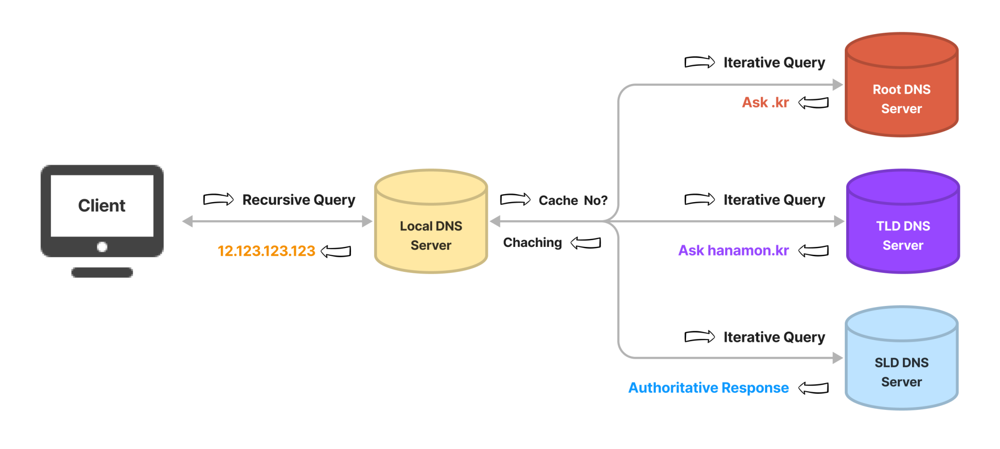

- [www.~.com에](http://www.%7E.xn--com-568n/) 접속할 때 생기는 과정에 대해 설명해주세요.(웹 동작 방식 이해)

[답변]

1. 사용자가 브라우저에 URL을 입력합니다.
2. DNS 서버에서 도메인 네임으로 서버의 주소를 찾습니다.
3. 해당 IP 주소로 tcp or udp 방식으로 통신합니다.
4. 클라이언트는 웹 서버로 HTTP 요청 메세지를 보냅니다.
5. 웹 서버는 HTTP 응답 메세지를 보냅니다.
6. 이렇게 도착한 HTTP 응답 메세지는 웹 페이지 데이터로 변환되고, 웹 브라우저에 의해 출력됩니다.

        💡 추가 질문 예상
        웹 서버: Http 프로토콜을 기반으로, 클라이언트의 요청을 서비스하는 기능을 담당
        정적, 동적(WAS에 요청)
        정적 리소스는 변화가 없는 리소스를 뜻한다. 즉, HTML, CSS, Javascript와 같이 미리 서버에 저장해두고 서버가 요청을 받으면 응답만 해주면 되는 것들을 뜻한다. 어느 사용자에게도 동일한 결과값을 보여준다.
        동적 리소스는 누가, 언제, 어떻게 서버에 요청했는지에 따라 결과값을 다르게 보여주는 리소스를 뜻한다. 사용자에게 맞춤형 콘텐츠를 제공해줄 수 있게 된다.
        
        WAS: 
        프로그램 실행 환경 및 DB 접속 기능 제공
        여러 트랜잭션 관리 기능
        업무 처리하는 비즈니스 로직 수행
        
        HTTP: (Hypertext Transfer Protocol) 클라이언트와 서버 간 통신을 위한 통신 프로토콜
        
        DNS 서버: 도메인 네임 시스템 서버로 도메인에 네트워크 주소를 저장하고있어서 사용자가 브라우저에 접근할 때 ip주소 대신 도메인으로 해당 주소에 접근이 가능합니다.
        
        - Host : 인터넷에 연결된 컴퓨터 한 대 한대
        - IP Address : host끼리 통신을 하기 위해 필요한 주소
        - IP 주소를 기억하는 것이 어렵기 때문에 DNS(Domain Name System)이 나왔습니다
            - DNS Server : 수많은 IP 주소와 도메인이 저장되어 있습니다
            - 웹에서 [www.naver.com을](http://www.naver.com/) 입력하면 DNS Server에 [www.naver.com의](http://www.naver.xn--com-yh0o/) IP 주소를 알려준 후, 그 IP 주소를 토대로 접속하는 것입니다.

DNS
https://galid1.tistory.com/53

웹 서버 vs WAS
[https://gyoogle.dev/blog/web-knowledge/Web Server와 WAS의 차이.html](https://gyoogle.dev/blog/web-knowledge/Web%20Server%EC%99%80%20WAS%EC%9D%98%20%EC%B0%A8%EC%9D%B4.html)
https://tecoble.techcourse.co.kr/post/2021-05-24-apache-tomcat/

- 3-way handshake에 대해 설명해주세요.(TCP 연결)

[답변]

연결 지향적인 TCP에서 통신을 하는 장치간 서로 연결이 잘 되어있는지 확인하는 과정/방식

[순서]

세그먼트 헤더에 위치한다.

여기서 SYN은 'synchronize sequence numbers', 그리고 ACK는'acknowledgment' 의 약자이다.

**[STEP 1]**

A클라이언트는 B서버에 접속을 요청하는 SYN 패킷을 보낸다. 이때 A클라이언트는 SYN 을 보내고 SYN/ACK 응답을 기다리는 SYN_SENT 상태가 되는 것이다.

**[STEP 2]**

B서버는 SYN요청을 받고 A클라이언트에게 요청을 수락한다는 ACK 와 SYN flag 가 설정된 패킷을 발송하고 A가 다시 ACK으로 응답하기를 기다린다. 이때 B서버는 SYN_RECEIVED 상태가 된다.

**[STEP 3]**

A클라이언트는 B서버에게 ACK을 보내고 이후로부터는 연결이 이루어지고 데이터가 오가게 되는것이다. 이때의 B서버 상태가 ESTABLISHED 이다.

        💡 추가 질문 예상
        4-way handshake는 뭐죠?
        이는 세션을 종료하기 위해 수행하는 과정/방식입니다.
        Client에서 연결 종료를 뜻하는 FIN을 보내고
        Server에서 ACK을 보낸 후 연결을 종료할 준비를 하고,
        준비가 되고 Server에서 FIN을 보냅니다.
        Client에서 ACK를 보내 세션의 연결을 끊게 됩니다.
        
        Client는 Server로부터 FIN을 수신하더라도 일정시간(디폴트 240초) 동안 세션을 남겨놓고 잉여 패킷을 기다리는 과정을 거치게 되는데 이 과정을 "TIME_WAIT" 라고 합니다.

- HTTP/2를 설명하고 장점 두가지를 말해보세요.

[답변]

HTTP/1.1의 Connection Keep-Alive, Pipelining이 개선된 것

HTTP/1.1의 동작은 기본적으로 Connection 한 개당 하나의 요청을 처리하도록 설계되어 있습니다. 동시 전송이 불가능하고 요청과 응답이 순차적으로 이뤄져 속도가 느립니다.

반면 HTTP/2는 Multiplexed Streams를 이용하여 하나의 TCP 연결을 통해 여러 데이터 요청을 병렬로 전송 가능합니다.

이밖에 Server Push, Binary protocol, 중복 헤더 프레임을 압축 등으로 지연 시간을 줄입니다.

Frame : HTTP/2 의 통신 최소 단위이다. 모든 패킷에는 하나의 Frame Header가 포함된다. → 이 프레임 헤더 내부에 프레임 식별자가 있어, 수신 측에서 응답 순서 상관없이 프레임을 받아도 순서대로 재배치 가능

Message : 논리적 요청 또는 응답 메시지에 매핑되는 프레임의 전체 시퀀스이다. → 프레임이 모여 메세지를 구성함

Stream : 하나 이상의 메시지가 전달 가능한 양방향의 데이터 흐름.
→ 각 스트림에는 양방향 메시지를 전달하는 데 사용되는 고유 식별자와 선택적 우선 순위 정보가 있음

- DNS에 대해 설명해주세요.

[답변]

도메인 네임 시스템으로 DNS 쿼리에 응답하고 도메인 이름을 IP 주소로 변환합니다.

- CORS란 무엇이며 동작과정을 설명해보세요.

[답변]

Cross-Origin Resource Sharing

cross-origin이란 다음 중 한 가지라도 다른 경우를 말합니다.

프로토콜 - http와 https는 프로토콜이 다르다.

도메인 - domain.com과 other-domain.com은 다르다.

포트 번호 - 8080포트와 3000포트는 다르다.

동작과정

1. 서버로 요청을 합니다.
2. 서버의 응답이 왔을 때 브라우저가 요청한 `Origin`과 응답한 헤더 `Access-Control-Request-Headers`의 값을 비교하여 유효한 요청이라면 리소스를 응답합니다. 만약 유효하지 않은 요청이라면 브라우저에서 이를 막고 에러가 발생합니다.

- HTTP Method와 각각이 사용되는 경우에 대해서 설명해주세요.

[답변]

- **주요 메소드**
    - **GET :** 리소스 조회
    - **POST:**  요청 데이터 처리, 주로 등록에 사용
    - **PUT :** 리소스를 대체(덮어쓰기), 해당 리소스가 없으면 생성
    - **PATCH :** 리소스 부분 변경 (PUT이 전체 변경, PATCH는 일부 변경)
    - **DELETE :** 리소스 삭제
- **기타 메소드**
    - **HEAD :** GET과 동일하지만 메시지 부분(body 부분)을 제외하고, 상태 줄과 헤더만 반환
    - **OPTIONS :** 대상 리소스에 대한 통신 가능 옵션(메서드)을 설명(주로 CORS에서 사용)
    - **CONNECT :** 대상 자원으로 식별되는 서버에 대한 터널을 설정
    - **TRACE :** 대상 리소스에 대한 경로를 따라 메시지 루프백 테스트를 수행

- HTTP와 HTTPS의 차이점은 무엇인가요?

[답변]

Hypertext Transfer Protocol Secure
브라우저와 서버가 데이터를 전송하기 전에 안전하고 암호화된 연결을 설정

**SSL 인증서 유무의 차이**

HTTP는 암호화되지 않은 데이터를 전송합니다. 즉, 브라우저에서 전송된 정보를 제3자가 가로채고 읽을 수 있습니다. 이는 이상적인 프로세스가 아니었기 때문에, 통신에 또 다른 보안 계층을 추가하기 위해 HTTPS로 확장되었습니다. HTTPS는 HTTP 요청 및 응답을 SSL 및 TLS 기술에 결합합니다.

HTTPS 웹 사이트는 독립된 인증 기관(CA)에서 SSL/TLS 인증서를 획득해야 합니다. 이러한 웹 사이트는 신뢰를 구축하기 위해 데이터를 교환하기 전에 브라우저와 인증서를 공유합니다. SSL 인증서는 암호화 정보도 포함하므로 서버와 웹 브라우저는 암호화된 데이터나 스크램블된 데이터를 교환할 수 있습니다. 프로세스는 다음과 같이 작동합니다.

1. 사용자 브라우저의 주소 표시줄에 *https://* URL 형식을 입력하여 HTTPS 웹 사이트를 방문합니다.
2. 브라우저는 서버의 SSL 인증서를 요청하여 사이트의 신뢰성을 검증하려고 시도합니다.
3. 서버는 퍼블릭 키가 포함된 SSL 인증서를 회신으로 전송합니다.
4. 웹 사이트의 SSL 인증서는 서버 아이덴티티를 증명합니다. 브라우저에서 인증되면, 브라우저가 퍼블릭 키를 사용하여 비밀 세션 키가 포함된 메시지를 암호화하고 전송합니다.
5. 웹 서버는 프라이빗 키를 사용하여 메시지를 해독하고 세션 키를 검색합니다. 그런 다음, 세션 키를 암호화하고 브라우저에 승인 메시지를 전송합니다.
6. 이제 브라우저와 웹 서버 모두 동일한 세션 키를 사용하여 메시지를 안전하게 교환하도록 전환합니다.

        💡 추가 질문 예상
        SSL 인증서가 왜 필요해요?
        
        HTTP는 암호화되지 않은 데이터를 전송합니다. 즉, 브라우저에서 전송된 정보를 제3자가 가로채고 읽을 수 있습니다. 이는 이상적인 프로세스가 아니었기 때문에, 통신에 또 다른 보안 계층을 추가하기 위해 HTTPS로 확장되었습니다. HTTPS는 HTTP 요청 및 응답을 SSL 및 TLS 기술에 결합합니다.
        
        HTTPS 웹 사이트는 독립된 인증 기관(CA)에서 SSL/TLS 인증서를 획득해야 합니다. 이러한 웹 사이트는 신뢰를 구축하기 위해 데이터를 교환하기 전에 브라우저와 인증서를 공유합니다. SSL 인증서는 암호화 정보도 포함하므로 서버와 웹 브라우저는 암호화된 데이터나 스크램블된 데이터를 교환할 수 있습니다. 프로세스는 다음과 같이 작동합니다.
        
        1. 사용자 브라우저의 주소 표시줄에 *https://* URL 형식을 입력하여 HTTPS 웹 사이트를 방문합니다.
        2. 브라우저는 서버의 SSL 인증서를 요청하여 사이트의 신뢰성을 검증하려고 시도합니다.
        3. 서버는 퍼블릭 키가 포함된 SSL 인증서를 회신으로 전송합니다.
        4. 웹 사이트의 SSL 인증서는 서버 아이덴티티를 증명합니다. 브라우저에서 인증되면, 브라우저가 퍼블릭 키를 사용하여 비밀 세션 키가 포함된 메시지를 암호화하고 전송합니다.
        5. 웹 서버는 프라이빗 키를 사용하여 메시지를 해독하고 세션 키를 검색합니다. 그런 다음, 세션 키를 암호화하고 브라우저에 승인 메시지를 전송합니다.
        6. 이제 브라우저와 웹 서버 모두 동일한 세션 키를 사용하여 메시지를 안전하게 교환하도록 전환합니다.

- GET과 POST의 차이점은 무엇인가요?

[답변]

|  | GET | POST |
| --- | --- | --- |
| 캐시 | ⭕️ | ❌ |
| 브라우저 기록 | ⭕️ | ❌ |
| 북마크 추가 | ⭕️ | ❌ |
| 데이터 길이 제한 | ⭕️ | ❌ |
| HTTP 응답 코드 | 200(Ok) | 201(Created) |
| 언제 주로 사용하는가? | 리소스 요청 | 리소스 생성 |
| 리소스 전달 방식 | 쿼리스트링 | HTTP Body |
| idempotent | ⭕️ | ❌ |
- GET 요청은 캐시가 가능하다.
- : GET을 통해 서버에 리소스를 요청할 때 웹 캐시가 요청을 가로채 서버로부터 리소스를 다시 다운로드하는 대신 리소스의 복사본을 반환한다. HTTP 헤더에서 cache-control 헤더를 통해 캐시 옵션을 지정할 수 있다.
- GET 요청은 브라우저 히스토리에 남는다.
- GET 요청은 길이 제한이 있다.
- GET 요청은 중요한 정보를 다루면 안된다. (보안)

---

- POST 요청은 캐시되지 않는다.
- POST 요청은 브라우저 히스토리에 남지 않는다.
- POST 요청은 데이터 길이에 제한이 없다.
