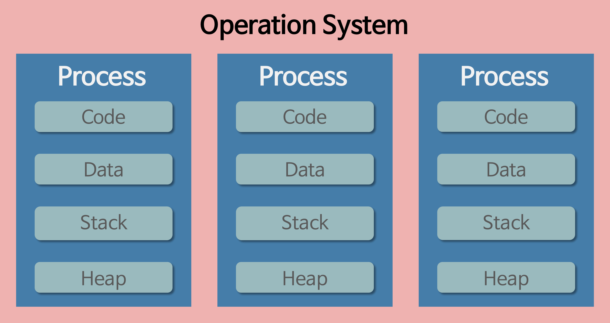
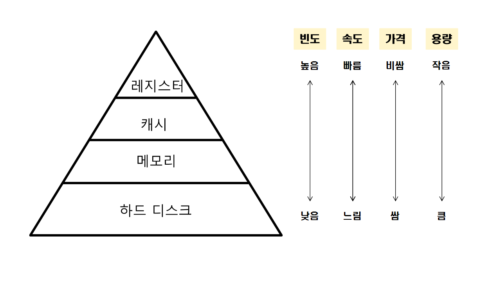

# Operating System

## 프로세스와 스레드의 차이는 무엇입니까?

- 프로세스는 메모리 상에서 실행중인 프로그램

- 스레드는 프로세스 안에서 실행되는 흐름 단위

## 크롬 탭 하나는 프로세스인가요? 스레드인가요?

- 크롬은 멀티 프로세스를 사용하며 IPC을 사용합니다. 멀티 프로세스는 비록 무겁지만 웹 사이트를 개발자가 별도의 심사 없이 배포하기 때문에, 악성 개발자가 공유 자원을 악용할 수 있습니다. 때문에, 안정적이고 빠른 사용자 경험을 위해 멀티 프로세스를 사용합니다.

## 가상메모리에 대해 설명해주세요

- 가상메모리는 물리 메모리 크기의 한계를 극복하기 위해 나온 기술로 물리 메모리보다 큰 프로세스를 수행하기 위해 사용됩니다. 가상 메모리는 프로세스를 실행할 때 필요한 부분만 메모리에 적재(부분적재)하여 메모리를 효율적으로 사용합니다.

## 메모리 계층구조에 대해 설명해주세요

- 메모리 계층 구조는 레지스터, 캐시, 메모리(주기억장치), 디스크(보조기억장치)로 이루어져 있습니다. 메모리가 여러 종류로 나누어진 이유는 CPU가 메모리에 더 빨리 접근하기 위해서 입니다. 그래서 상위 계층은 속도가 빠르지만 가격이 비싸고 용량이 작지만, 하위 계층은 가격이 저렴하고 용량이 크지만 속도는 느리다는 특징이 있습니다.

## 동기와 비동기에 대해 설명해 주세요.

- 동기 방식은 직렬적으로 일을 처리하는 방식입니다. 즉, 요청이 들어오면 순차적으로 작업을 수행하고, 해당 작업이 완료되기 전까지 대기하게 됩니다. 반면에 비동기 방식은 병렬적으로 일을 처리합니다. 즉, 요청이 들어오면 해당 요청에 의한 작업이 끝나지 않았더라도 계속 요청을 받을 수 있으며, 작업이 끝났다는 이벤트가 오면 해당 요청을 처리합니다.

## 세마포어와 뮤텍스의 차이에 대해 설명해주세요.

- 세마포어와 뮤텍스 모두 공유 메모리의 동기화 문제를 해결하는 동기화 도구입니다. 이들 모두 공유된 자원의 데이터를 여러 스레드 또는 프로세스가 접근하는 것을 막는 역할을 합니다. 뮤텍스는 동기화 대상을 하나로 제한하며 key를 소유한 스레드/프로세스 만이 공유 자원에 접근할 수 있는 권한이 생기는 상호배제 기법입니다. 세마포어는 동기화 대상이 하나 이상이며 공유 자원에 접근할 수 있는 최대 허용치 만큼 동시에 접근할 수 있는 상호배제 기법입니다.
- Mutex는 동기화 대상이 오직 1개일 때 사용하며, Semaphore는 동기화 대상이 1개 이상일 때 사용합니다.
- Mutex는 자원을 소유할 수 있고, 책임을 가지는 반면 Semaphore는 자원 소유가 불가능합니다.
- Mutex는 상태가 0, 1 뿐이므로 Lock을 가질 수 있고, 소유하고 있는 스레드만이 이 Mutex를 해제할 수 있습니다. 반면 Semaphore는 Semaphore를 소유하지 않는 스레드가 Semaphore를 해제할 수 있습니다.
- Semaphore는 시스템 범위에 걸쳐 있고, 파일 시스템 상의 파일로 존재합니다. 반면, Mutex는 프로세스의 범위를 가지며 프로세스 종료될 때 자동으로 Clean up 됩니다.

## 페이징과 세그멘테이션에 대해 설명해주세요

- 페이징과 세그멘테이션 모두 프로그램을 실행하기 위해 디스크에 있는 내용을 분할하여 메모리에 적재하는 불연속 메모리 관리 기법입니다. 페이징은 프로세스를 일정한 크기의 페이지로 분할해서 메모리에 적재하는 방식입니다. 페이징은 메모리 공간이 연속적이어야 한다는 제약을 없앴기 때문에 외분 단편화가 생기지 않지만 일정한 크기의 페이지로 나누기 때문에 내부 단편화가 생길 수 있습니다. 세그멘테이션은 프로세스를 물리적 단위인 페이지가 아닌 논리적 단위인 세그먼트로 분할해서 메모리에 적재하는 방식입니다. 세그멘테이션은 일정한 크기로 분할하지 않기 때문에 내부 단편화 문제가 해소되지만, 외부 단편화 문제가 생길 수 있습니다.

## 데드락에 대해 설명해주세요

- 데드락(DeadLock, 교착 상태) 이란?
  - 두 개 이상의 프로세스 혹은 스레드가 서로가 가진 리소스를 기다리는 상태
  ### DeadLock을 만드는 네 가지 조건
  1. **Mutual exclusion(상호 배제)**
     - 리소스(resource)를 공유해서 사용할 수 없다
  2. **Hold and wait(점유 대기)**
     - 프로세스가 이미 하나 이상의 리소스를 취득한(hold) 상태에서 다른 프로세스가 사용하고 있는 리소스를 추가로 기다린다(wait)
  3. **No preemption(비선점)**
     - 리소스 반환(release)은 오직 그 리소스를 취득한 프로세스만 할 수 있다. → 다른 프로세스에 할당되어 있는 자원을 강제로 뺏을 수 없다.
  4. **Circular wait(순환 대기)**
     - 프로세스들이 순환(circular) 형태로 서로의 리소스를 기다린다
    <aside>
    📢 DeadLock 발생 조건 **4가지를 모두 만족**해야 DeadLock이 발생할 수 있다.
    
    </aside>
    
    ### DeadLock 해결 방법
    
    1. **방지(Prevention)**
        - 4가지 발생 조건 중 하나 이상의 조건을 만족하지 않게 하여 DeadLock 발생을 방지
        - Mutual exclusion(상호 배제)
            - 리소스를 공유 가능하게 함
        - Hold and wait(점유 대기)
            - 사용할 리소스들을 모두 획득한 뒤에 시작 → 리소스 사용 효율이 떨어짐
            - 리소스를 전혀 가지지 않은 상태에서만 리소스 요청 → starvation 현상
        - No preemption(비선점)
            - 프로세스가 자원을 점유하고 있을 때, 해당 자원에 대한 우선순위가 더 높은 프로세스가 자원을 뺏을 수 있음
            - 자원을 뺏긴 프로세스는 ready 상태로 돌아감
                - 선점 당한 쓰레드가 어떤 작업을 하고 있었는지 모른 채 뺏어버리면 문제가 발생할 수 있음.
                    - 뺏기기 전까지 작업한 내용이 날라감
                    - starvation 현상 발생
        - Circular wait(순환 대기)
            - 모든 리소스에 순서 체계를 부여해서 오름차순으로 리소스를 요청
    2. **회피(avoidance)**
        - 실행 환경에서 **추가적인 정보(**Safe State, Safe Sequence**)**를 활용해서 **데드락이 발생할 것 같은 상황(**Unsafe State**)**을 회피하는 것
        
        <aside>
        📢 **- Safe Sequence(안전 순서)**
            - 프로세스들에게 자원을 할당 할 때 데드락이 발생하지 않는 할당 순서
        
        **- Safe State(안전 상태)**
            - Safe Sequence 가 존재하는 상태
            - Deadlock 이 발생하지 않는 상태
        
        **- Unsafe State(불안정 상태)**
            - Safe Sequence 가 없는 상태
            - Deadlock 이 발생할 수도 있는 상태
        
        </aside>
        
        - Resource Allocation Graph Algorithm(자원 할당 그래프 알고리즘)
            - 그래프를 가지고 데드락의 발생 여부를 판단하여 자원 할당 여부를 결정하는 알고리즘
            - 각 자원이 인스턴스를 하나만 가지고 있는 경우에 사용하는 알고리즘
            - 자원 할당 그래프를 그려보면서 cycle이 생기지 않게 해 교착상태 회피
            - 요청 간선(claim dege)을 그래프에 추가하면서 순환 구조가 발생하는지 판단한다.
        - Banker's Algorithm(은행원 알고리즘)
            - 자원 할당 전에 예상되는 모든 자원의 최대 할당량을 가지고 시뮬레이션을 하여 safe state에 들 수 있는지 여부를 검사하여 교착상태의 가능성을 미리 조사하는 알고리즘
            - 각 자원이 인스턴스를 여러개 가지고 있는 경우에 사용
            - 알고리즘 발동 조건이 까다로워서 사용되지 않음
    3. **탐지와 복구**
        - 데드락을 허용하고 데드락이 발생하면 복구하는 전략
        - 탐지 기법
            - 자원 할당 그래프 알고리즘, 은행원 알고리즘과 비슷한 방식으로 데드락을 탐지함
        - 회복 기법
            - 프로세스 중단
                - 교착 상태에 빠진 모든 프로세스를 중단하는 방식
                - 프로세스를 하나씩 중단시키면서 매번 탐지 알고리즘을 새로 돌려서 데드락을 확인하는 방식
            - 자원 선점
                - 데드락을 해결할 때까지 다른 프로세스에게 자원을 할당해 주는 방식
    4. **데드락 무시**
        - 아 몰랑 개발자가 알아서 하겠지. 은근히 많은 운영체제들이 선택.
