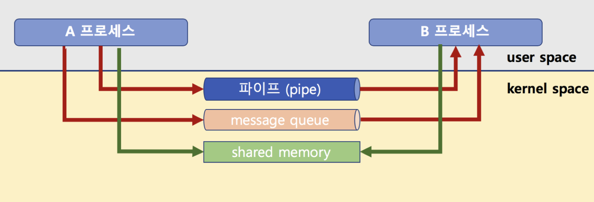

# 1. 프로세스와 스레드의 차이는 무엇입니까?

### 답변

우선 프로세스와 스레드는 범위가 다릅니다. 프로세스는 작업 중인 프로그램을 뜻하고, 스레드는 프로세스 안에서 실행되는 가장 작은 실행 단위입니다.

또 다른 차이점은 **프로세스**는 다른 프로세스의 메모리(Code, Data, Heap)에 **직접적인** 접근이 안되지만, **스레드는 가능(**별도의 stack을 가지고 있어서 복붙**)**

프로세스는 운영체제로부터 자원을 할당받는 작업의 단위
즉, 실행되어 작업 중인 프로그램(메모리에 적재되고, CPU 자원을 할당받아)
(작업 관리자>프로세스)
스레드는 프로세스가 할당받은 자원을 이용하는 실행의 단위
프로세스 내에서 진행되는 작업, 흐름의 단위

### 예상 꼬리 질문

**멀티 프로세스**

장점: 한 프로세스가 비정상적으로 종료되어도 다른 프로세스에 영향을 주지 않음(각 프로세스가 독립적인 메모리 공간을 가지므로)
ex: 대기 또는 나가기해도 다른 탭은 멀쩡

단점: 동일한 프로그램을 여러 개의 프로세스로 만들게 되면, 그만큼 메모리를 차지하고 CPU에서 할당받는 자원이 중복됨(각 프로세스가 메모리 공간을 갖는 특징때문에)
또한 컨텍스트 스위칭 행위가 반복되면 비용 오버헤드가 발생(CPU 캐시에 있는 내용을 모두 초기화)
(이를 위해서 프로세스 수를 적정하게 유지하거나, I/O 바운드 작업이 많은 프로세스와 CPU 바운드 작업이 많은 프로세스를 분리하여 관리하고, CPU 캐시를 효율적으로 활용하는 등의 방법을 고려)

**멀티 스레드**

장점: 프로세스 대비 용량이 가벼움, 데이터 공유가 원활하여 자원의 효율적인 활용 가능(heap영역과 같은 공유 메모리에 대해 스레드간 자원 공유가 가능해서)
stack, register만 교체하면 되는 컨텍스트 스위칭 ⇒ 응답 시간 단축

단점: 안정성과 보안 등에서 취약
하나의 스레드에서 문제가 발생하면 다른 부분에서 영향을 받음
자원 공유가 되기때문에 동기화 문제 발생 가능 → 병목 현상을 예방하기 위해 임계 영역(critical section)에 대해 뮤텍스 or 세마포어 활용

**프로세스 자원공유**

IPC(Inter Process): file, pipe, mq, signal

LPC(Local inter Process) → 이건 잘 모르겠음

별도로 공유 메모리를 만들어서 

멀티 태스킹: Task란 OS에서 처리하는 작업단위를 의미하는데 그 여러 작업 단위가 빠르게 처리되어 동시에 처리되는것처럼 보이는 것을 의미, 연속성(Concurrent)

컨텍스트 스위칭: CPU에서 실행할 프로세스의 정보(PCB)를 교체하는 기술

---

# 2. 크롬 탭 하나는 프로세스인가요? 스레드인가요?

### 답변

프로세스입니다.(하나의 프로세스는 아님)

크롬은 chromium(크로뮴)기반입니다. chromium은 Multi-process Architecture를 사용하기 때문에

이건 작업 관리자에서도 확인 가능합니다. 각 탭, 확장 프로그램마다 프로세스 성능이 나옵니다.

최상위 chrome.exe(부모 프로세스)를 종료할 경우 브라우저 자체가 종료됩니다.

Multi-thread Architecture는 성능면에서 유리하지만, 안정성과 보안 등에서 취약합니다.

참고: https://puleugo.tistory.com/162
https://developer.chrome.com/blog/inside-browser-part1/

---

# 3. 가상메모리에 대해 설명해주세요.

가상메모리는 프로세스 전체를 메모리에 올리는 것이 아니라 실행이 필요한 일부분만 메모리에 올려 프로세스 전체가 마치 메모리에 있는 것 처럼 보이게 하는 기술입니다.

요구 페이징(demand paging): (필요한)페이지 단위로 메모리에 올리는 것

페이지: RAM을 여러 부분으로 나눈 것(메모리를 일일이 가상 주소에서 물리적 주소로 번역하게 되면 작업 부하가 너무 높아져서)

MMU(Memory Management Unit): 가상주소를 물리주소로 변환하고, 메모리를 보호하는 기능 수행, 각 메모리에 접근하기 이전에 메모리 주소 번역 작업 수행

페이지 폴트(page faults): 가상 메모리엔 존재하지만 시스템의 RAM에는 존재하지 않는 데이터, 토드에 접근 시도할 경우 발생하는 현상

주소 변환 캐시(TLB): 가상 메모리 주소를 물리적 주소로 변환하는 속도를 높이기 위해 사용하는 캐시로, 최근에 일어난 가상 메모리와 물리 주소의 변환 테이블을 저장, 여기 없으면 MMU가 페이지 테이블을 보고 주소 변환

---

# 4. 메모리 계층구조에 대해 설명해주세요.

메모리 계층 구조는 레지스터, 캐시, 메모리, 디스크로 구성되어있습니다.

CPU가 메모리에 더 빨리 접근 가능하게 필요에 의해서 분리

각 계층 별 특징은 이렇습니다.

**레지스터**: CPU내부 위치, [기억, 해석, 연산, 제어]를 관할, 특정 주소를 가리키거나 값 읽을 수 있음

CPU는 자체적으로 데이터를 저장할 방법이 없어 연산을 위해 레지스터를 거쳐야 함

**캐시**: 데이터나 값을 미리 복사해 놓는 임시 장소, L3와 디스크캐시는 CPU안에 위치X

**메모리**: 주기억장치

- RAM: 휘발성 기억 장치, 데이터를 단기간 저장하는 구성 요소
- ROM: 고정 기억 장치(비휘발성), 초기 부팅, 펌웨어 명령등 변경 가능성이 희박한 기능에 사용

**디스트**: 비휘발성 보조 기억 장치, SSD, HDD

### 예상 꼬리 질문 대비

CPU는 메모리에 접근할 때 컨트롤 신호를 복호화하여 해석함

큰 메모리일 수록 디코딩 시간이 오래 걸림

프로그램이 시작되는 과정

- 프로그램은 우선 보조기억장치에 저장이 된다.
- 프로그램을 실행 시키려면 내부적으로 운영체제에게 요청을 한다.
- 사용자로부터 프로글매을 실행시키라는 명령을 받은 운영체제는 보조기억장치에서 주기억장치로 프로그램을 복사한다.
- 이후 CPU가 메모리에 있는 프로그램을 한줄 한줄씩 읽으면서 수행을 한다.

---

# 5. 동기와 비동기에 대해 설명해 주세요.

동기는 실행과 결과값이 동시에 나온다고 하여 어떠한 작업이 끝날때까지는 다른 작업을 하지 못합니다.

반면 비동기는 다른 작업의 완료 유무를 따지지않고 작업 실행이 가능합니다. 자원을 효율적으로 사용 가능합니다.

### 예상 꼬리 질문 대비

Blocking vs NonBlocking

Blocking: 작업이 끝날 때까지 제어권을 주지 않는 것

NonBlocking: 작업이 마치지않아도 제어권을 줌

동기 & Blocking: 제어권이 넘어갔고, 순서대로 진행(동기)되어야 해서 대기 시간 발생

동기 & NonBlocking: 제어권이 넘어가지 않았지만, 순서대로 진행(동기)되어야 해서 완료 확인을 계속 함

비동기 & Blocking: 순서대로 안해도 되지만, 제어권이 넘어가서 대기 시간 발생

비동기 & NonBlocking: 제어권이 넘어가지 않았고, 순서대로 진행되지 않아도 됨. 호출하고 작업 완료 시 콜백

프로세스 동기화: 여러 프로세스가 공유하는 자원의 일관성을 유지하는 것

---

# 6. 세마포어와 뮤텍스의 차이에 대해 설명해주세요.

**뮤텍스(mutex)**

임계 구역에 1개의 스레드만 들어갈 수 있는 동기화 기법

**세마포어(semaphore)**

임계 구역에 여러 스레드가 들어갈 수 있고, counter를 두어서 허용 가능한 스레드를 제한하는 기법

|  | Semaphore | Mutex |
| --- | --- | --- |
| 개수 | N개 | 하나 |
| 변화 | Mutex로 변경 가능 | Semaphore로 변경 불가능 |
| 소유 | X | O |
| 해제 | Semaphore를 가지지 않은 스레드도 해제 가능 | Mutex를 소유한 스레드만 해제 가능 |
| 함수 | wait | lock |
|  | signal | unlock |

---

# 7. 페이징과 세그멘테이션에 대해 설명해주세요.

페이징(고정 크기, 내부 단편화 발생 가능)

- 프로세스의 주소 공간을 고정된 사이즈의 페이지 단위로 나누어 물리적 메모리에 불연속적으로 할당하는 방식
- 메모리는 Frame이라는 고정크기로 분할되고, 프로세스는 Page라는 고정크기로 분할됨
- 페이지와 프레임은 크기가 같음
- 페이지와 프레임을 대응시키는 page mapping 과정이 필요하여 paging table을 생성해야 함
- 연속적이지 않은 공간도 활용할 수 있기 때문에 외부 단편화 문제 해결
- 페이지 테이블에는 각 페이지 번호와 해당 페이지가 할당된 프레임의 시작 물리 주소를 저장

**But, 프로세스의 크기가 페이지 크기의 배수가 아닐 경우 마지막 페이지에 내부 단편화가 발생하고 페이지의 크기가 클수록 내부 단편화가 커짐**

=> 페이지 단위를 작게 하면 내부 단편화 문제도 해결할 수 있겠지만 page mapping 과정이 많아지므로 효율이 떨어짐

세그멘테이션(가변 크기, 외부 단편화 발생 가능)

- 프로세스를 서로 크기가 다른 논리적인 블록 단위인 세그먼트(Segment)로 분할하여 메모리에 할당
- 각 세그먼트는 연속적인 공간에 저장
- 세그먼트들의 크기가 서로 다르기 때문에 프로세스가 메모리에 적재될 때 빈 공간을 찾아 할당하는 기법
- 페이징과 마찬가지로 mapping을 위한 segment table 필요

**But, 프로세스가 필요한 메모리 공간만큼 메모리를 할당해주기 때문에 내부 단편화 문제는 발생하지 않지만, 중간에 메모리를 해제하면 생기는 외부 단편화 문제가 발생**

단편화 참고: https://cocoon1787.tistory.com/859

---

# 8. 데드락에 대해 설명해주세요.

데드락은 두 개이상의 프로세스 혹은 스레드가 서로가 가진 리소스를 기다리는 상태입니다.(교착 상태 → 무한 대기)

이러한 데드락을 발생시키는 조건은 4가지입니다.

상호 배제(Mutual exclusion)

- 리소스(critial session or lock ,cpu, 메모리, ssd 등)를 
공유해서 사용할 수 없음

점유 대기(Hold and wait)

- 프로세스가 이미 하나 이상의 리소스를 취득한(hold)한 상태에서
다른 프로세스가 사용하고 있는 리소스를 추가로 기다림(wait)

비선점(No preemption)

- 리소스 반환은 오직 그 리소스를 취득한 프로세스만 할 수 있음

순환 대기(Circular wait)

- 프로세스들이 순환 형태로 서로의 리소스를 기다린다.

해결방법

발생 조건 중 하나 이상을 제거

회피(프로세스 수 고정 등 은행원 알고리즘, 자원 할당 알고리즘을 사용)

탐지 및 회복

무시
